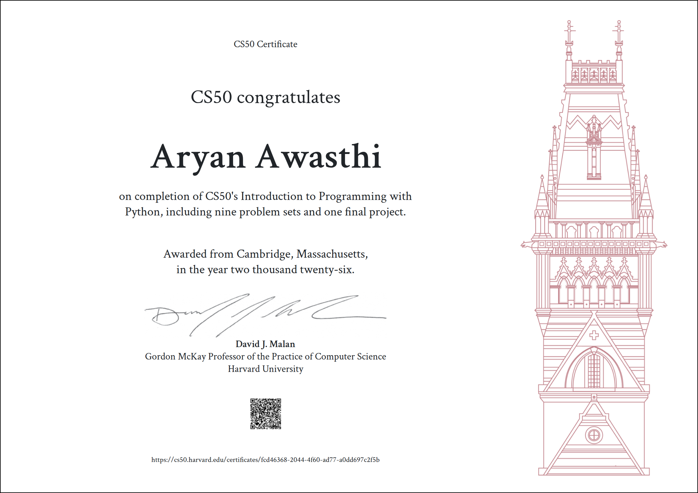

# CS50P — Introduction to Programming with Python

Solutions to the problem sets and final project for [CS50's Introduction to Programming with Python](https://cs50.harvard.edu/python/).

## Problem Sets

| Week | Topic                       | Problem                  |            Solution            |
| :--: | --------------------------- | ------------------------ | :----------------------------: |
|   0  | Functions, Variables        | Einstein                 |   [Folder](./week0/einstein)   |
|      |                             | Faces                    |     [Folder](./week0/faces)    |
|      |                             | Indoor Voice             |    [Folder](./week0/indoor)    |
|      |                             | Playback Speed           |   [Folder](./week0/playback)   |
|      |                             | Tip Calculator           |      [Folder](./week0/tip)     |
|   1  | Conditionals                | Bank                     |     [Folder](./week1/bank)     |
|      |                             | Deep Thought             |     [Folder](./week1/deep)     |
|      |                             | Extensions               |  [Folder](./week1/extensions)  |
|      |                             | Interpreter              |  [Folder](./week1/interpreter) |
|      |                             | Meal Time                |     [Folder](./week1/meal)     |
|   2  | Loops                       | Camel Case               |     [Folder](./week2/camel)    |
|      |                             | Coke Machine             |     [Folder](./week2/coke)     |
|      |                             | Vanity Plates            |    [Folder](./week2/plates)    |
|      |                             | Just setting up my twttr |     [Folder](./week2/twttr)    |
|   3  | Exceptions                  | Fuel Gauge               |     [Folder](./week3/fuel)     |
|      |                             | Grocery List             |    [Folder](./week3/grocery)   |
|      |                             | Outdated                 |   [Folder](./week3/outdated)   |
|      |                             | Taqueria                 |   [Folder](./week3/taqueria)   |
|   4  | Libraries                   | Adieu, Adieu             |     [Folder](./week4/adieu)    |
|      |                             | Bitcoin Price Index      |    [Folder](./week4/bitcoin)   |
|      |                             | Emojize                  |    [Folder](./week4/emojize)   |
|      |                             | Figlet                   |    [Folder](./week4/figlet)    |
|      |                             | Guessing Game            |     [Folder](./week4/game)     |
|      |                             | Little Professor         |   [Folder](./week4/professor)  |
|   5  | Unit Tests                  | Bank                     |   [Folder](./week5/test_bank)  |
|      |                             | Fuel Gauge               |   [Folder](./week5/test_fuel)  |
|      |                             | Vanity Plates            |  [Folder](./week5/test_plates) |
|      |                             | twttr                    |  [Folder](./week5/test_twttr)  |
|   6  | File I/O                    | Lines of Code            |     [Folder](./week6/lines)    |
|      |                             | Pizza Py                 |     [Folder](./week6/pizza)    |
|      |                             | Scourgify                |   [Folder](./week6/scourgify)  |
|      |                             | Shirt                    |     [Folder](./week6/shirt)    |
|   7  | Regular Expressions         | NUMB3RS                  |    [Folder](./week7/numb3rs)   |
|      |                             | Response Validation      |   [Folder](./week7/response)   |
|      |                             | Um                       |      [Folder](./week7/um)      |
|      |                             | Watch on YouTube         |     [Folder](./week7/watch)    |
|      |                             | Working 9 to 5           |    [Folder](./week7/working)   |
|   8  | Object-Oriented Programming | Jar                      |      [Folder](./week8/jar)     |
|      |                             | Seasons of Love          |    [Folder](./week8/seasons)   |
|      |                             | Shirtificate             | [Folder](./week8/shirtificate) |

## Final Project

[View Project](./project)

## Certificate

